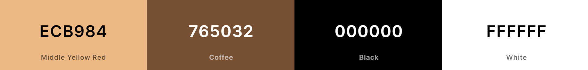
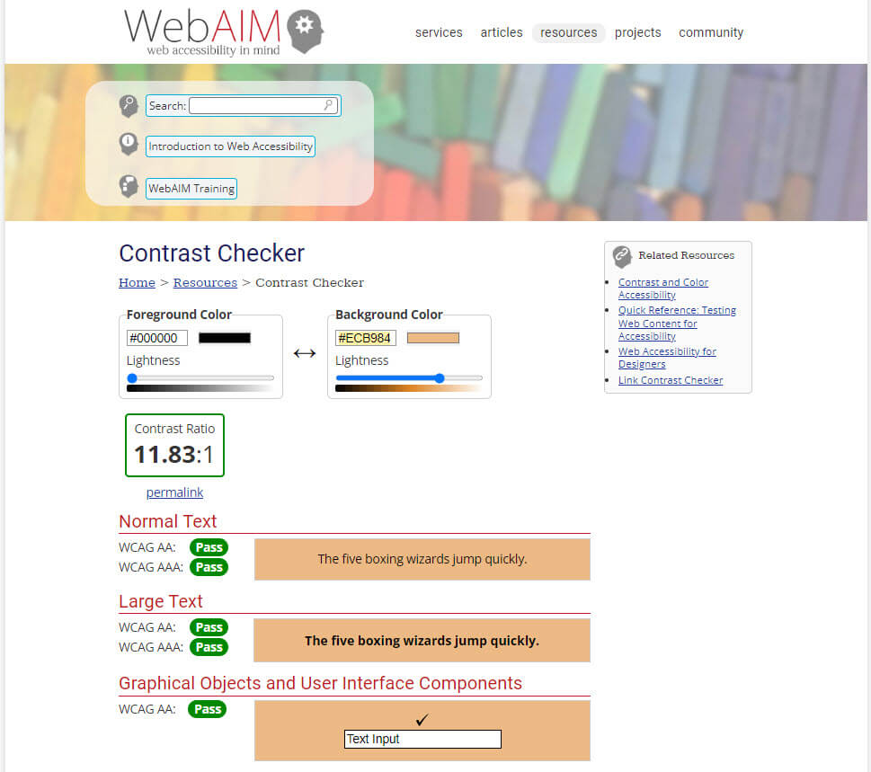
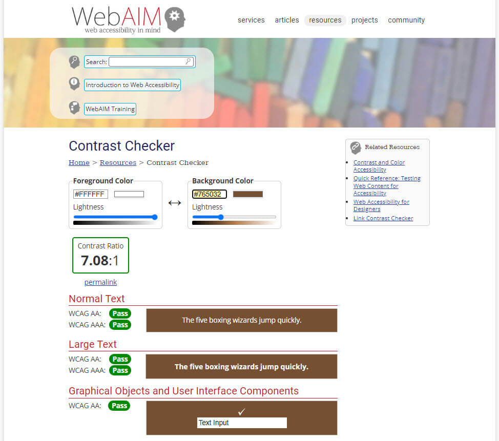

<h1 align="center">Grounded Earth Holistics</h1>

<h3>Milestone Four Project - Full Stack Frameworks With Django</h3>
 

[View the deployed Grounded Earth Holistics]

**Please note: To open any links in this document in a new browser tab, press 'CTRL + Click'.**

# Table of Contents

<b>(click to expand or hide)</b>

<!-- Markdown TOC -->

1. [Description](#description)
2. [User Experience (UX)](#user-experience-(ux))
   * [User Stories](#user-stories)
   * [5 Planes](#5-planes)
     1. [Strategy](#strategy)
     2. [Scope](#scope)
     3. [Structure](#structure)
     4. [Skeleton](#skeleton)
     5. [Surface](#surface)
3. [Features](#features)
   * [Current Features](#current-features)
   * [Future Features](#future-features)
4. [Technologies Used](#technologies-used)
5. [Testing](#testing)
6. [Lessons Learned](#lessons-learned)
7. [Deployment](#deployment)
8. [Credits](#credits)

<!-- /Markdown TOC -->

# Description  

I am currently studying the Full Stack Development Course through Code Institute. Part of the course I am required to complete 4 milestone projects. Grounded Earth Holistics is my 4th milestone project which is part of the Full Stack Frameworks with Django.

Grounded Earth Holistics is an e-commerce site that has been created for customers that would like a holistic experience. This experience includes a deeply relaxing session with either Tuning Forks or healing crystals. Customers can purchase various products through a secure checkout.

Some of the content and images have been copied from [Grounded Earth Holistics](https://www.groundedearthholistics.com.au/) with their permission.

[Back to Table of Contents](#table-of-contents)

# User Experience (UX)

## User Stories  

First Time Customer Goals

* As a first time customer to the website, I would like to:
  * search for products
  * see the number of products that are available
  * view all products
  * view individual product details
  * sort the list of available products by price
  * sort the list of available products by category
  * read reviews about a product
  * view holistic services
  * increase and decrease the item quantity
  * be able to purchase products through a secure checkout
  * view items in my shopping bag
  * adjust items in my shopping bag
  * receive confirmation that the products have been purchased
  * create an account
  * receive confirmation that the account has been created

Returning Customer Goals

* As a returning customer to the website, I would like to:
  * have the ability to log in so my information is saved
  * be able to log out of the site
  * recover my password in case I forget it
  * create, update and delete my own reviews
  * read other reviews

Site Owner Goals

* As a site owner of the website, I would like to:
  * be able to add products
  * be able to edit products
  * be able to delete products

[Back to Table of Contents](#table-of-contents)

## 5 Planes

### 1. Strategy

The purpose of this project is to create an e-commerce site where users can purchase holistic products through a secure checkout and view what holistic services are available

### 2. Scope

The features of this project will include:

* The ability to:
  * search for products
  * view products
  * view services
  * register to save their personal information
  * log in and out
  * purchase products through a secure checkout
  * have the site owner add, edit and delete products

### 3. Structure

The information is grouped logically for all users. The Interaction Design (IXD) will be consistent between pages where the navigation bar is fixed and tailored to have the priority items displayed first at the top of the screen. The footer will scroll with the page. A user can either search, view or purchase products through a secure checkout or log in to save their information. The site will be consistent with what users expect from an e-commerce store.

### 4. Skeleton

The [wireframes](./static/documents/wireframes/grounded-earth-holistics.pdf) have been created using [Balsamiq](https://balsamiq.com) and were created for Desktop, Tablet and Phone. 

Here are the individual wireframes:

* [Home Page Wireframe](static/images/readme-images/wireframes/home-page.png)
* [Holistic Services - Tuning Therapy Wireframe](static/images/readme-images/wireframes/holistic-services-tuning-therapy.png)
* [Holistic Services - Grounding Wireframe](static/images/readme-images/wireframes/holistic-services-grounding.png)
* [Products Wireframe](static/images/readme-images/wireframes/products.png)
* [Individual Products Wireframe](static/images/readme-images/wireframes/individual-products.png)
* [About Wireframe](static/images/readme-images/wireframes/about.png)
* [Log In Wireframe](static/images/readme-images/wireframes/login.png)
* [Register Wireframe](static/images/readme-images/wireframes/register.png)
* [Product Management Wireframe](static/images/readme-images/wireframes/product-management.png)
* [Shopping Bag Wireframe](static/images/readme-images/wireframes/shopping-bag.png)
* [Checkout Wireframe](static/images/readme-images/wireframes/checkout.png)
* [Thank You Wireframe](static/images/readme-images/wireframes/thank-you.png)

### 5. Surface 

Colour Scheme

* The original colour scheme of the existing website did not pass the accessibility test so I used colours that had an earthy feel about them.
* After googling earthy colours I found [this colour scheme](https://www.schemecolor.com/everything-is-earthy-color-scheme.php) by [schemecolor.com](https://www.schemecolor.com/)
* I used #ECB984 (Middle Yellow Red) as the background colour for the header and footer
* For the free postage banner I took the colour #D58258 and changed the contrast colour to #765032 (Coffee) so it would pass accessibility. These 2 colours compliment each other.
* The pages have a white #FFFFFF background.
* The text is all in black #000000.

Colours were displayed using [Coolors](https://coolors.co/ecb984-765032-000000-ffffff)

* The colours were checked through [WebAIM](https://webaim.org/resources/contrastchecker/) to ensure the final colours were accessible.

Typography

* The fonts were sourced from [Google Fonts](https://fonts.google.com/).
* The main text font I used the same as the original website which is the font family of Raleway.
* The font from the original website for headings was Jubilat, which is not from Google Fonts.
* I then googled Raleway font pairing and found a match on [Figma](https://www.figma.com/google-fonts/raleway-font-pairings/#:~:text=Raleway%20font%20pairing,PT%20Sans%2C%20and%20Open%20Sans.)
* I selected Merriweather for all headings.
* The backup font for both the headings and the main text is Sans Serif.

Imagery

* All imagery was sourced from [Grounded Earth Holistics](https://www.groundedearthholistics.com.au/) with permission from the site owner.

[Back to Table of Contents](#table-of-contents)

# Features

**Current Features**

Each page features:

* A header that consists of:
  * Free postage banner
  * The name of the site
  * A search bar
  * My Account icon where you can Register and Login
  * A Shopping Bag icon with the amount spent
  * A navbar consisting of Holistic Services, All Products, Crystals, Candles & Candle Holders, Bath Luxuries, Cacao and Gift Packs
* A footer that consists of About, Copyright and Developed By, a Facebook and Instagram Link

The Home Page features:

* The name of the website
* Information about what the website is about
* An image
* A Shop Now button

The Holistic Services dropdown features:

* Tuning Therapy which directs you to learn all about Tuning Therapy
* Grounding which directs you to learn all about Grounding techniques

The All Products dropdown features:

* All products by price or category - This displays all products by price and the customer can either sort by:
  * Price (low to high)
  * Price (high to low)
  * Name (A-Z)
  * Name (Z-A)
  * Category (A-Z)
  * Category (Z-A)

The other nav items include:

* Crystals, Candles & Candle Holders, Bath Luxuries, Cacao and Gift Packs
* Each individual dropdown displays the appropriate products for that category which include:
  * An image of the product
  * The name of the product
  * The price of the product
  * The category of the product
* All products are able to be sorted as advised above
* The number of products displays for the user

All products you can click the image and the product will display in its own page where you can select the quantity and add to bag.

The My Account icon in the header allows a customer to either Log In or Register.

A logged in user can select My Profile from My Account which will display their default delivery information and order history.

The Shopping Bag:

* The Shopping Bag icon displays the amount that is to be charged, after adding products to the shopping bag
* Gives the customer the option to increase or decrease the quantity and update their shopping bag
* Gives the customer the option to remove an item from the shopping bag
* Advises the bag total, delivery fee, grand total, how much more you can spend to get free delivery
* Gives the customer a link to keep shopping
* Gives the customer a link to the secure checkout

The Checkout displays:

* A form for the customer to complete with their relevant name, email, phone number and postal details of where to send the product to
* An order summary of what the customer is about to purchase
* A payment field where the customer can add their credit card details
* An adjust bag link if the customer needs to adjust their purchase
* A complete order link
* An information prompt that displays how much the customers credit card will be charged

The Complete Order link displays:

* A success message in the top right hand corner
* A thank you page that provides all the order information
* That a confirmation email will be sent to the customer

Super User / Site Owner:

* A Super User / Site Owner will also have the option after logging in to be able to go to the Product Management page
* The Product Management page allows the site owner to add a product
* Can also go to any product and either edit the product or delete the product

**Future Features to implement**

[Back to Table of Contents](#table-of-contents)

# Technologies Used

**Languages**

**Frameworks and Libraries**

**Programs and Resources**

[Back to Table of Contents](#table-of-contents)

# Testing

[See Testing.md for testing information](TESTING.md)

[Back to Table of Contents](#table-of-contents)

# Lessons Learned

[Back to Table of Contents](#table-of-contents)

# Deployment

**How to Fork a Repository**

**Run this site locally/clone site**

[Back to Table of Contents](#table-of-contents)

# Credits

Code

Content  

Media

Acknowledgements

[Back to Table of Contents](#table-of-contents)